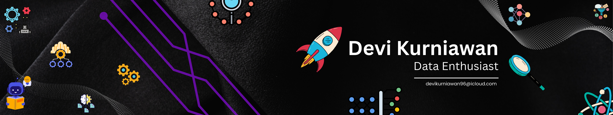

# 💫 About Me:
Saya seorang pendidik yang bersemangat, setiap hari berinteraksi dengan generasi penerus bangsa untuk membuka pintu pengetahuan. Namun, di balik peran sebagai guru, saya punya ambisi besar: **menguasai Data Science!** 🙌
 -------------------------
 guru yang baik tidak pernah berhenti belajar, dan **Data Science** adalah buku baru yang saya buka dengan penuh rasa ingin tahu! 📚🕵️‍♂️
 Jika Anda sesama pecinta data atau punya saran belajar, mari terhubung!
## 🌐 Socials: 
  

# 💻 Tech Stack:
            

<picture>
  <source media="(prefers-color-scheme: dark)" srcset="https://raw.githubusercontent.com/tobiasmeyhoefer/tobiasmeyhoefer/output/github-snake-dark.svg" />
  <source media="(prefers-color-scheme: light)" srcset="https://raw.githubusercontent.com/tobiasmeyhoefer/tobiasmeyhoefer/output/github-snake.svg" />
  
</picture>
<!-- Proudly created with GPRM ( https://gprm.itsvg.in ) -->
